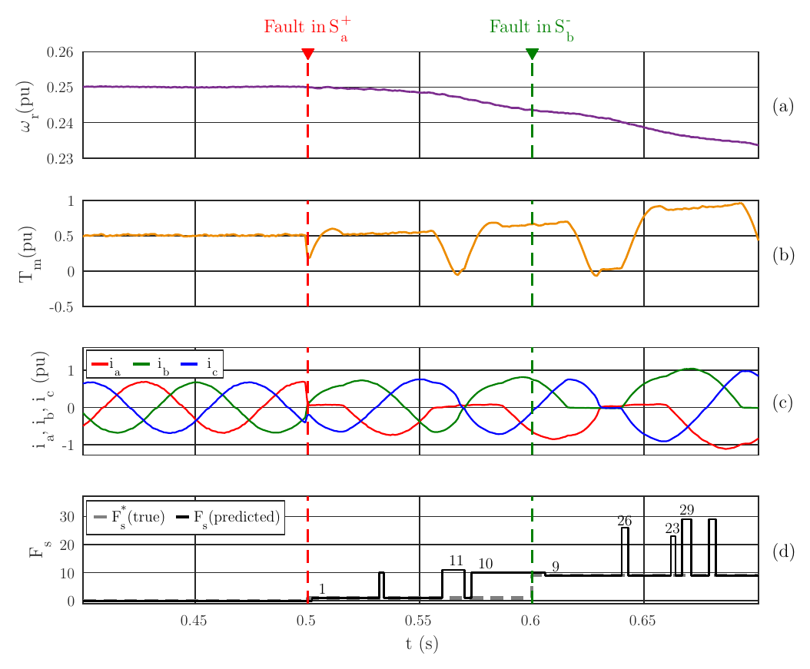
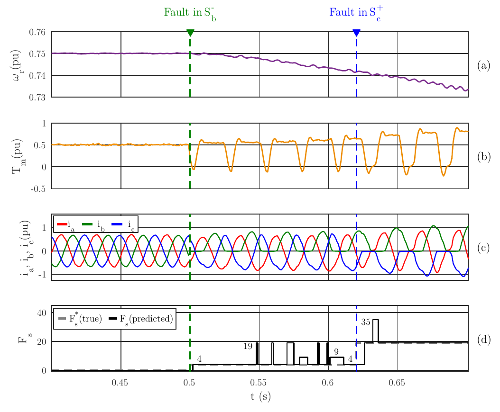
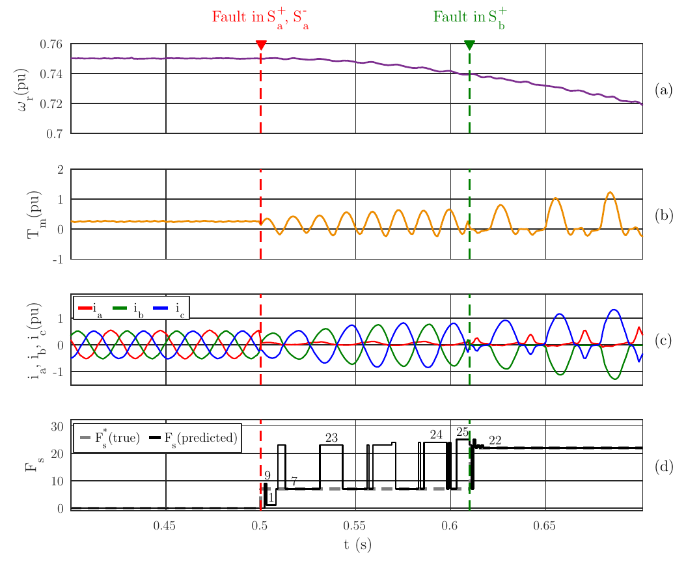
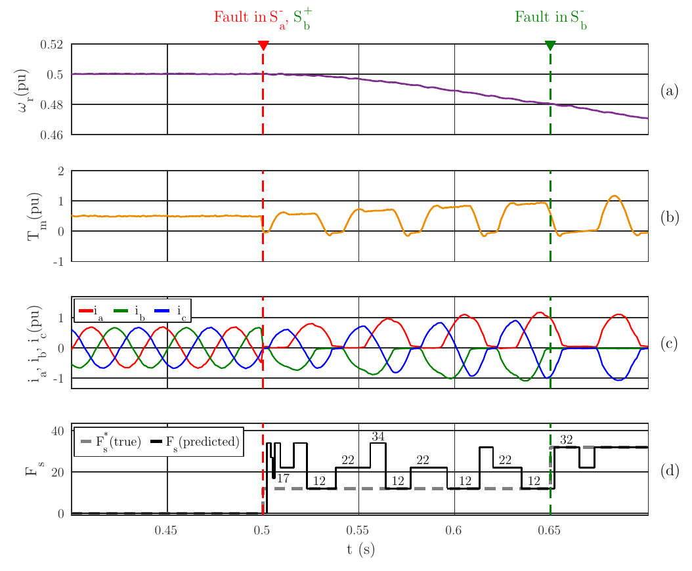
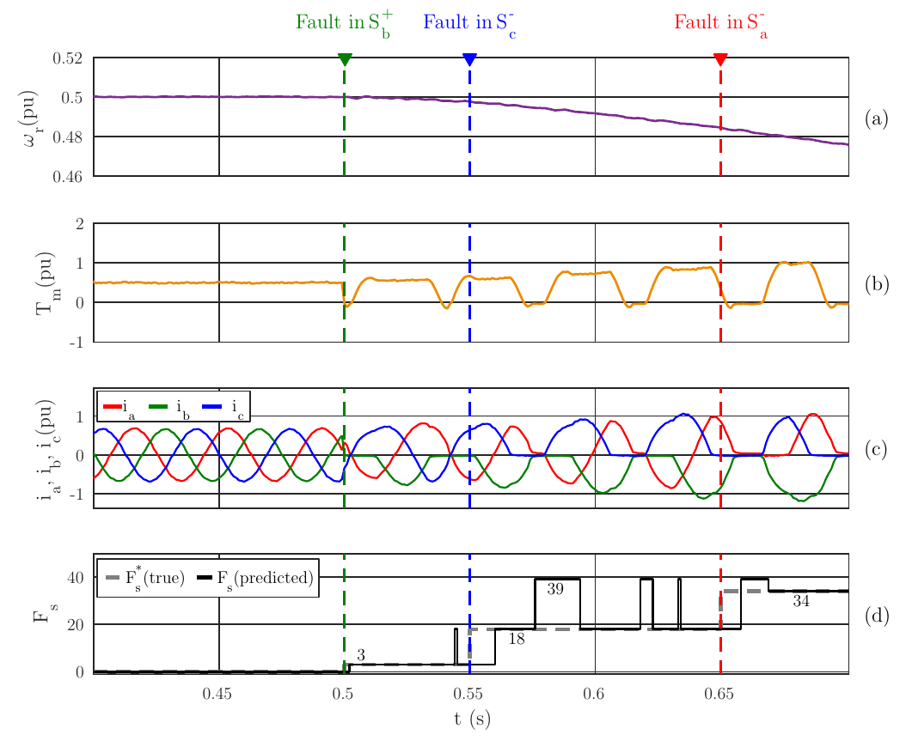

# Inverter switch fault diagnosis: experimental validation

[](https://creativecommons.org/licenses/by-nc-nd/4.0/)

This repository contains the experimental data, the neural network predictions and the MATLAB script that generates the validation figures for fault diagnosis in the switches of a three-phase inverter (S<sub>a</sub><sup>+</sup>, S<sub>a</sub><sup>−</sup>, S<sub>b</sub><sup>+</sup>, S<sub>b</sub><sup>−</sup>, S<sub>c</sub><sup>+</sup>, S<sub>c</sub><sup>−</sup>).

The network was **trained exclusively on simulation data** and **validated with experimental tests**. Five tests (sec1, sec3, sec5, sec6 and sec7) were selected from a set of [8 fault sequences](#full-set-of-tested-fault-sequences) carried out in the laboratory. **Tests sec5, sec6 and sec7 correspond to scenarios the network was not trained on**, so they assess its generalization capability.

## Included tests

| Test | Speed (%) | Torque (%) | Fault sequence | F<sub>s</sub><sup>*</sup> classes | Scenario seen in training |
|:----:|:---------:|:----------:|----------------|:--------------------:|:-------------------------:|
| sec1 | 25 | 50 | S<sub>a</sub><sup>+</sup> (0.50 s) → S<sub>b</sub><sup>−</sup> (0.60 s) | 0 → 1 → 9 | Yes |
| sec3 | 75 | 50 | S<sub>b</sub><sup>−</sup> (0.50 s) → S<sub>c</sub><sup>+</sup> (0.62 s) | 0 → 4 → 19 | Yes |
| sec5 | 75 | 25 | S<sub>a</sub><sup>+</sup> and S<sub>a</sub><sup>−</sup> (0.50 s) → S<sub>b</sub><sup>+</sup> (0.61 s) | 0 → 7 → 22 | **No** |
| sec6 | 50 | 50 | S<sub>a</sub><sup>−</sup> and S<sub>b</sub><sup>+</sup> (0.50 s) → S<sub>b</sub><sup>−</sup> (0.65 s) | 0 → 12 → 32 | **No** |
| sec7 | 50 | 50 | S<sub>b</sub><sup>+</sup> (0.50 s) → S<sub>c</sub><sup>−</sup> (0.55 s) → S<sub>a</sub><sup>−</sup> (0.65 s) | 0 → 3 → 18 → 34 | **No** |

Each record lasts 1.3 s. Faults accumulate: once a switch fails, it remains faulty until the end of the test. The F<sub>s</sub><sup>*</sup> column gives the true class in each interval (see [Class encoding](#class-encoding)).

The times indicate the instant at which each fault is applied. Its effect on the currents only becomes visible when the phase current goes through the half-cycle in which the faulty switch conducts, so it may appear with some delay with respect to the vertical line that marks the fault in the figures.

### Full set of tested fault sequences

| Sequence | Fault 1 | t fault 1 (ms) | Fault 2 | t fault 2 (ms) | Fault 3 | t fault 3 (ms) | Speed (%) | Torque (%) | Included in this repository |
|:--------:|:-------:|:--------------:|:-------:|:--------------:|:-------:|:--------------:|:---------:|:----------:|:---------------------------:|
| 1 | S<sub>a</sub><sup>+</sup> | 500 | S<sub>b</sub><sup>−</sup> | 600 | — | — | 25 | 50 | sec1 |
| 2 | S<sub>a</sub><sup>+</sup> | 500 | S<sub>a</sub><sup>−</sup> | 550 | — | — | 50 | 25 | — |
| 3 | S<sub>b</sub><sup>−</sup> | 500 | S<sub>c</sub><sup>+</sup> | 620 | — | — | 75 | 50 | sec3 |
| 4 | S<sub>b</sub><sup>+</sup> | 500 | S<sub>b</sub><sup>−</sup> | 2000 | — | — | 75 | 25 | — |
| 5 | S<sub>a</sub><sup>+</sup> | 500 | S<sub>a</sub><sup>−</sup> | 500 | S<sub>b</sub><sup>+</sup> | 610 | 75 | 25 | sec5 |
| 6 | S<sub>b</sub><sup>+</sup> | 500 | S<sub>a</sub><sup>−</sup> | 500 | S<sub>b</sub><sup>−</sup> | 650 | 50 | 50 | sec6 |
| 7 | S<sub>b</sub><sup>+</sup> | 500 | S<sub>c</sub><sup>−</sup> | 550 | S<sub>a</sub><sup>−</sup> | 650 | 50 | 50 | sec7 |
| 8 | S<sub>c</sub><sup>−</sup> | 500 | — | — | — | — | 25 | 75 | — |

## Repository structure

```
.
├── README.md
├── LICENSE
├── .gitignore
├── leer_ensayo_ia16bits5.m        Main script: reads, processes and plots one test
├── 2026_06_10_ia/                 Test data
│   ├── parametros.m               Acquisition parameters and signal names
│   ├── secX.dat                   Raw data acquired in each test
│   └── secX_predictions.xlsx      Network predictions for each test
└── figures/
    ├── secX_fault_diagnosis.pdf   Final figure for each test
    └── secX_fault_diagnosis.png   Same figure as PNG (for viewing on GitHub)
```

## How to run

1. Clone or download the repository.
2. In MATLAB, set the current folder to the repository root (the folder containing `leer_ensayo_ia16bits5.m`). All paths in the script are relative to this folder.
3. Open `leer_ensayo_ia16bits5.m` and select the test in the line:
   ```matlab
   archivo_dat = 'sec7';   % Available tests: sec1, sec3, sec5, sec6, sec7
   ```
4. Run the script.

The script generates:

- `figures/secX_fault_diagnosis.pdf`: the final figure (overwrites the one included in the repository).
- `2026_06_10_ia/datos_secX.mat`: structure `adq` with all the signals of the test and the time vector `adq.t`.
- `2026_06_10_ia/datos_secX_proc.mat`: matrix `i_abc` with the normalized phase currents over a 201-sample interval.

The `.mat` files are not tracked (they are listed in `.gitignore`) because they are recreated every time the script runs.

**Requirements:** MATLAB R2015a or later. The code avoids functions and syntax introduced after that version (for example, it uses `bsxfun` instead of implicit expansion). No additional toolboxes are required.

The comments inside the MATLAB scripts are written in Spanish.

## Results

Each figure has four panels: (a) rotor speed ω<sub>r</sub>, (b) torque T<sub>m</sub>, (c) phase currents i<sub>a</sub>, i<sub>b</sub>, i<sub>c</sub>, and (d) true class F<sub>s</sub><sup>*</sup> (gray, dashed) versus the class predicted by the network F<sub>s</sub> (black). The vertical lines mark the fault instants, colored according to the phase of the faulty switch.

<details>
<summary><b>sec1</b>: S<sub>a</sub><sup>+</sup> → S<sub>b</sub><sup>−</sup> (scenario seen in training)</summary>


</details>

<details>
<summary><b>sec3</b>: S<sub>b</sub><sup>−</sup> → S<sub>c</sub><sup>+</sup> (scenario seen in training)</summary>


</details>

<details>
<summary><b>sec5</b>: S<sub>a</sub><sup>+</sup>, S<sub>a</sub><sup>−</sup> → S<sub>b</sub><sup>+</sup> (unseen scenario)</summary>


</details>

<details>
<summary><b>sec6</b>: S<sub>a</sub><sup>−</sup>, S<sub>b</sub><sup>+</sup> → S<sub>b</sub><sup>−</sup> (unseen scenario)</summary>


</details>

<details>
<summary><b>sec7</b>: S<sub>b</sub><sup>+</sup> → S<sub>c</sub><sup>−</sup> → S<sub>a</sub><sup>−</sup> (unseen scenario)</summary>


</details>

## License

This repository (experimental data, network predictions, figures and code) is licensed under the [Creative Commons Attribution-NonCommercial-NoDerivatives 4.0 International License (CC BY-NC-ND 4.0)](https://creativecommons.org/licenses/by-nc-nd/4.0/). See the [LICENSE](LICENSE) file for details.

In short, the material may be shared provided that:

- **Attribution:** appropriate credit is given to the authors.
- **NonCommercial:** it is not used for commercial purposes.
- **NoDerivatives:** modified versions of the material are not distributed.

## Data format

### `.dat` files

Text file with one header line (acquisition metadata, ignored by the script) followed by 18,200 integer values, one per line. The values correspond to 14 signals of 1300 samples each, stored in consecutive blocks (first the 1300 samples of signal 1, then those of signal 2, and so on).

- Sampling period: 1 ms (1 kHz).
- Scaling: values are divided by 16,384 (2<sup>14</sup>) to obtain per-unit quantities.

The signal order is defined in `parametros.m`:

| # | Signal | Description |
|:-:|--------|-------------|
| 1 | `i_alp_ref` | Reference current, α axis |
| 2 | `i_bet_ref` | Reference current, β axis |
| 3 | `lam_alp_est` | Estimated flux, α axis |
| 4 | `lam_bet_est` | Estimated flux, β axis |
| 5 | `wr` | Rotor speed |
| 6 | `i_a` | Phase a current |
| 7 | `i_b` | Phase b current (i<sub>c</sub> = −i<sub>a</sub> − i<sub>b</sub>) |
| 8 | `n_muestra` | Sample counter |
| 9 | `esc` | Scenario signal: changes value at each fault instant |
| 10 | `i_d` | d-axis current |
| 11 | `i_q` | q-axis current (used as per-unit torque) |
| 12 | `v_alp` | Voltage, α axis |
| 13 | `v_bet` | Voltage, β axis |
| 14 | `tita` | Angle (normalized) |

### `_predictions.xlsx` files

One row per analysis window. Each window spans 100 samples and slides by one sample (302 windows per test).

| Column | Content |
|--------|---------|
| `window_id` | Window number |
| `start_sample`, `end_sample` | First and last sample of the window (zero-based, relative to the processed interval) |
| `true_class` | True class F<sub>s</sub><sup>*</sup> |
| `pred_class` | Class predicted by the network F<sub>s</sub> |
| `confidence` | Probability assigned to the predicted class |
| `class_2nd`, `prob_2nd` | Second most likely class and its probability |
| `class_3rd`, `prob_3rd` | Third most likely class and its probability |

The script uses the `end_sample`, `pred_class` and `true_class` columns. To place each prediction in time, it aligns the first change in `true_class` with the first change in the `esc` signal (first fault). If this automatic alignment is not possible, it uses the `s_ini_pred` value defined at the beginning of the script.

## Class encoding

The 42 classes are numbered as follows: 0 is the healthy condition, 1–6 are single faults, 7–21 double faults and 22–41 triple faults. Within each group, switch combinations follow lexicographic order over S<sub>a</sub><sup>+</sup>, S<sub>a</sub><sup>−</sup>, S<sub>b</sub><sup>+</sup>, S<sub>b</sub><sup>−</sup>, S<sub>c</sub><sup>+</sup>, S<sub>c</sub><sup>−</sup>.

<details>
<summary>Full class table</summary>

| Class | Type | Faulty switches |
|:-----:|------|-----------------|
| 0 | Healthy | — |
| 1 | Single | S<sub>a</sub><sup>+</sup> |
| 2 | Single | S<sub>a</sub><sup>−</sup> |
| 3 | Single | S<sub>b</sub><sup>+</sup> |
| 4 | Single | S<sub>b</sub><sup>−</sup> |
| 5 | Single | S<sub>c</sub><sup>+</sup> |
| 6 | Single | S<sub>c</sub><sup>−</sup> |
| 7 | Double | S<sub>a</sub><sup>+</sup>, S<sub>a</sub><sup>−</sup> |
| 8 | Double | S<sub>a</sub><sup>+</sup>, S<sub>b</sub><sup>+</sup> |
| 9 | Double | S<sub>a</sub><sup>+</sup>, S<sub>b</sub><sup>−</sup> |
| 10 | Double | S<sub>a</sub><sup>+</sup>, S<sub>c</sub><sup>+</sup> |
| 11 | Double | S<sub>a</sub><sup>+</sup>, S<sub>c</sub><sup>−</sup> |
| 12 | Double | S<sub>a</sub><sup>−</sup>, S<sub>b</sub><sup>+</sup> |
| 13 | Double | S<sub>a</sub><sup>−</sup>, S<sub>b</sub><sup>−</sup> |
| 14 | Double | S<sub>a</sub><sup>−</sup>, S<sub>c</sub><sup>+</sup> |
| 15 | Double | S<sub>a</sub><sup>−</sup>, S<sub>c</sub><sup>−</sup> |
| 16 | Double | S<sub>b</sub><sup>+</sup>, S<sub>b</sub><sup>−</sup> |
| 17 | Double | S<sub>b</sub><sup>+</sup>, S<sub>c</sub><sup>+</sup> |
| 18 | Double | S<sub>b</sub><sup>+</sup>, S<sub>c</sub><sup>−</sup> |
| 19 | Double | S<sub>b</sub><sup>−</sup>, S<sub>c</sub><sup>+</sup> |
| 20 | Double | S<sub>b</sub><sup>−</sup>, S<sub>c</sub><sup>−</sup> |
| 21 | Double | S<sub>c</sub><sup>+</sup>, S<sub>c</sub><sup>−</sup> |
| 22 | Triple | S<sub>a</sub><sup>+</sup>, S<sub>a</sub><sup>−</sup>, S<sub>b</sub><sup>+</sup> |
| 23 | Triple | S<sub>a</sub><sup>+</sup>, S<sub>a</sub><sup>−</sup>, S<sub>b</sub><sup>−</sup> |
| 24 | Triple | S<sub>a</sub><sup>+</sup>, S<sub>a</sub><sup>−</sup>, S<sub>c</sub><sup>+</sup> |
| 25 | Triple | S<sub>a</sub><sup>+</sup>, S<sub>a</sub><sup>−</sup>, S<sub>c</sub><sup>−</sup> |
| 26 | Triple | S<sub>a</sub><sup>+</sup>, S<sub>b</sub><sup>+</sup>, S<sub>b</sub><sup>−</sup> |
| 27 | Triple | S<sub>a</sub><sup>+</sup>, S<sub>b</sub><sup>+</sup>, S<sub>c</sub><sup>+</sup> |
| 28 | Triple | S<sub>a</sub><sup>+</sup>, S<sub>b</sub><sup>+</sup>, S<sub>c</sub><sup>−</sup> |
| 29 | Triple | S<sub>a</sub><sup>+</sup>, S<sub>b</sub><sup>−</sup>, S<sub>c</sub><sup>+</sup> |
| 30 | Triple | S<sub>a</sub><sup>+</sup>, S<sub>b</sub><sup>−</sup>, S<sub>c</sub><sup>−</sup> |
| 31 | Triple | S<sub>a</sub><sup>+</sup>, S<sub>c</sub><sup>+</sup>, S<sub>c</sub><sup>−</sup> |
| 32 | Triple | S<sub>a</sub><sup>−</sup>, S<sub>b</sub><sup>+</sup>, S<sub>b</sub><sup>−</sup> |
| 33 | Triple | S<sub>a</sub><sup>−</sup>, S<sub>b</sub><sup>+</sup>, S<sub>c</sub><sup>+</sup> |
| 34 | Triple | S<sub>a</sub><sup>−</sup>, S<sub>b</sub><sup>+</sup>, S<sub>c</sub><sup>−</sup> |
| 35 | Triple | S<sub>a</sub><sup>−</sup>, S<sub>b</sub><sup>−</sup>, S<sub>c</sub><sup>+</sup> |
| 36 | Triple | S<sub>a</sub><sup>−</sup>, S<sub>b</sub><sup>−</sup>, S<sub>c</sub><sup>−</sup> |
| 37 | Triple | S<sub>a</sub><sup>−</sup>, S<sub>c</sub><sup>+</sup>, S<sub>c</sub><sup>−</sup> |
| 38 | Triple | S<sub>b</sub><sup>+</sup>, S<sub>b</sub><sup>−</sup>, S<sub>c</sub><sup>+</sup> |
| 39 | Triple | S<sub>b</sub><sup>+</sup>, S<sub>b</sub><sup>−</sup>, S<sub>c</sub><sup>−</sup> |
| 40 | Triple | S<sub>b</sub><sup>+</sup>, S<sub>c</sub><sup>+</sup>, S<sub>c</sub><sup>−</sup> |
| 41 | Triple | S<sub>b</sub><sup>−</sup>, S<sub>c</sub><sup>+</sup>, S<sub>c</sub><sup>−</sup> |
</details>
